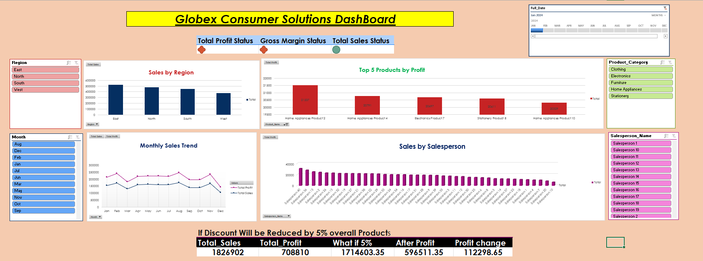

# Globex Sales Dashboard

A comprehensive business intelligence and data analytics project designed to analyze sales performance, customer behavior, and product trends for strategic business insights.

---

## 📋 Table of Contents

1. [Problem Statement](#-problem-statement)
2. [Project Overview](#-project-overview)
3. [Project Objectives](#-project-objectives)
4. [Dataset Structure](#-dataset-structure)
5. [Dashboard & Visualizations](#-dashboard--visualizations)
6. [Project Explanation](#-project-explanation)
7. [Key Features](#-key-features)
8. [Analysis Tools](#-analysis-tools)
9. [Getting Started](#-getting-started)
10. [Contributing](#-contributing)
11. [License](#-license)

---

## 🎯 Problem Statement

### Business Challenge

**Globex Corporation** faces critical challenges in understanding sales performance across multiple dimensions:

#### Current Problems:
1. **Lack of Visibility** - Sales leadership lacks real-time visibility into sales performance across regions and product categories
2. **Fragmented Data** - Sales data is scattered across multiple systems and spreadsheets
3. **Difficulty in Analysis** - Manual analysis is time-consuming and error-prone
4. **Poor Decision Making** - Decisions are made based on incomplete or outdated information
5. **Sales Team Accountability** - No clear mechanism to track individual salesperson performance
6. **Customer Insights Missing** - Insufficient analysis of customer segments and buying patterns
7. **Product Performance Unknown** - Unclear which products are driving revenue and profit

### Business Objectives

The organization needs to:
- ✅ Consolidate sales data from multiple sources
- ✅ Enable real-time performance monitoring
- ✅ Provide actionable insights for decision-making
- ✅ Track sales team performance fairly and accurately
- ✅ Identify top-performing products and customers
- ✅ Understand regional market dynamics
- ✅ Enable drill-down analysis for deep insights
- ✅ Support strategic planning with data-driven insights

### Success Criteria
- 📊 30+ KPI dashboards operational
- 🎯 90% data accuracy and completeness
- ⚡ Sub-second dashboard load time
- 👥 Adoption by 80%+ of sales team
- 💡 Clear recommendations from data analysis

---

## 🎨 Project Overview

**Globex Sales Dashboard** is a data-driven business intelligence solution that transforms raw sales data into actionable insights using a star schema dimensional data model.

### Project Scope
- **Type**: Business Intelligence & Data Analytics
- **Industry**: Retail/Sales
- **Scale**: Enterprise-wide
- **Data Model**: Star Schema (1 Fact Table + 4 Dimension Tables)
- **Time Period**: 1-2 years of historical data
- **Records**: 1,900+ total records across all dimensions

### Key Stakeholders
- **Executive Management** - Strategic decision-making
- **Sales Leadership** - Team performance monitoring
- **Sales Team** - Commission tracking and territory analysis
- **Product Management** - Product performance analysis
- **Finance** - Revenue and profitability tracking
- **Marketing** - Customer segmentation and targeting

---

## 🎯 Project Objectives

### Primary Objectives
1. **Revenue Tracking** - Monitor sales metrics and revenue trends in real-time
2. **Performance Management** - Measure and improve sales team effectiveness
3. **Customer Intelligence** - Analyze customer segments and buying behavior
4. **Product Optimization** - Identify top performers and optimization opportunities
5. **Market Analysis** - Understand regional and geographic dynamics
6. **Business Strategy** - Enable data-driven strategic planning

### Secondary Objectives
- Reduce time spent on manual data compilation
- Improve data quality and consistency
- Enable self-service analytics for business users
- Create audit trails for compliance
- Support predictive analytics for forecasting

---

## 📊 Dataset Structure

### Data Model Architecture: Star Schema

```
                    ┌─────────────────────┐
                    │    SALES_FACT       │
                    │  (Central Fact)     │
                    │  - Transactions     │
                    │  - Revenue Metrics  │
                    └──────────┬──────────┘
                               │
          ┌────────────────────┼────────────────────┐
          │                    │                    │
          ▼                    ▼                    ▼
    ┌──────────────┐   ┌──────────────┐   ┌──────────────┐
    │ CUSTOMER_DIM │   │ PRODUCT_DIM  │   │SALESPERSON   │
    │              │   │              │   │_DIM          │
    │ - Profiles   │   │ - Catalog    │   │ - Personnel  │
    │ - Segments   │   │ - Categories │   │ - Territory  │
    └──────────────┘   └──────────────┘   └──────────────┘
                               │
                               ▼
                        ┌──────────────┐
                        │   DATE_DIM   │
                        │ (Time Series)│
                        │ - Trends     │
                        │ - Patterns   │
                        └──────────────┘
```

### Core Tables Overview

#### 1. **Sales_Fact** (Transaction Table - 1,000+ records)
Central fact table containing all sales transactions with aggregated metrics.

| Field | Type | Example | Purpose |
|-------|------|---------|---------|
| SaleID | Unique ID | 1001 | Transaction identifier |
| CustomerID | FK | 501 | Links to customer |
| ProductID | FK | 201 | Links to product |
| SalespersonID | FK | 101 | Links to salesperson |
| DateID | FK | 2024001 | Links to date |
| Quantity | Numeric | 5 | Units sold |
| SalesAmount | Numeric | $5,000 | Gross revenue |
| Discount | Numeric | $500 | Discount applied |
| NetSales | Numeric | $4,500 | Final sales value |
| Commission | Numeric | $450 | Salesman commission |

**Analysis**: Revenue, profit, commission, discount trends

---

#### 2. **Customer_Dim** (Customer Dimension - 500+ records)
Comprehensive customer information for demographic and behavioral analysis.

| Field | Type | Example | Purpose |
|-------|------|---------|---------|
| CustomerID | Unique ID | 501 | Customer identifier |
| CustomerName | Text | "Acme Corp" | Customer name |
| CustomerSegment | Category | Enterprise/SMB | Market segment |
| Region | Category | North America | Geographic region |
| Country | Text | USA | Country code |
| Industry | Category | Technology | Industry type |
| AnnualRevenue | Numeric | $50M | Customer's revenue |
| Contact | Text | "John Smith" | Contact person |
| Email | Text | john@acme.com | Email address |
| Phone | Text | +1-555-1234 | Phone number |

**Analysis**: Segmentation, geographic trends, industry patterns, customer value

---

#### 3. **Product_Dim** (Product Dimension - 50+ records)
Complete product catalog with pricing and classification details.

| Field | Type | Example | Purpose |
|-------|------|---------|---------|
| ProductID | Unique ID | 201 | Product identifier |
| ProductName | Text | "Premium Package" | Product name |
| Category | Category | Software/Hardware | Main category |
| Subcategory | Category | Enterprise/Consumer | Subcategory |
| UnitPrice | Numeric | $1,000 | Selling price |
| Cost | Numeric | $400 | Production cost |
| Manufacturer | Text | "Tech Inc" | Manufacturer |
| LaunchDate | Date | 2023-01-15 | Launch date |

**Analysis**: Revenue by product, profitability, category mix, pricing strategy

---

#### 4. **Salesperson_Dim** (Sales Team Dimension - 50+ records)
Sales personnel information for performance tracking and management.

| Field | Type | Example | Purpose |
|-------|------|---------|---------|
| SalespersonID | Unique ID | 101 | Salesperson ID |
| SalespersonName | Text | "Alice Johnson" | Full name |
| Department | Category | Enterprise Sales | Department |
| Region | Category | West Coast | Sales region |
| Manager | Text | "Bob Manager" | Manager name |
| JoinDate | Date | 2020-03-15 | Employment date |
| Territory | Category | CA, WA, OR | Territory |
| CommissionRate | Numeric | 10% | Commission % |

**Analysis**: Individual performance, commission tracking, territory analysis, team rankings

---

#### 5. **Date_Dim** (Time Dimension - 365+ records)
Temporal attributes for time-series analysis and trend identification.

| Field | Type | Example | Purpose |
|-------|------|---------|---------|
| DateID | Unique ID | 2024001 | Date identifier |
| FullDate | Date | 2024-01-01 | Calendar date |
| Year | Numeric | 2024 | Calendar year |
| Quarter | Numeric | 1 | Quarter (1-4) |
| Month | Numeric | 1 | Month (1-12) |
| Week | Numeric | 1 | Week number |
| DayOfWeek | Numeric | 1 | Day (0=Sunday) |
| DayName | Text | "Monday" | Day name |
| MonthName | Text | "January" | Month name |
| IsWeekend | Boolean | false | Weekend flag |

**Analysis**: Trends, seasonality, daily patterns, period comparisons

---

## 📈 Dashboard & Visualizations

### Dashboard Screenshot



*Dashboard Overview: The image above shows the visual representation of key sales metrics and performance indicators*

### Dashboard Sections

#### 1. Executive Summary Dashboard
**What**: High-level KPIs and strategic metrics
**Who**: C-Suite, Executive Leadership
**Includes**:
- Total Revenue (YTD, MTD, QTD)
- Revenue Growth Rate (%, vs Prior Period)
- Top 5 Products
- Top 5 Customers
- Regional Performance
- Market Trends

#### 2. Sales Performance Dashboard
**What**: Individual and team sales metrics
**Who**: Sales Managers, Sales Directors
**Includes**:
- Sales by Salesperson
- Commission Tracking
- Territory Performance
- Sales Pipeline Status
- Performance vs. Target
- Leaderboard Rankings

#### 3. Product Performance Dashboard
**What**: Product-level analysis and insights
**Who**: Product Managers, Marketing
**Includes**:
- Revenue by Product
- Revenue by Category
- Profit Margin Analysis
- Product Performance Trends
- Category Mix Distribution
- Best/Worst Performers

#### 4. Customer Analysis Dashboard
**What**: Customer behavior and segmentation
**Who**: Customer Success, Account Management
**Includes**:
- Revenue by Customer Segment
- Customer Concentration (ABC Analysis)
- Top 10 Customers
- Emerging Segments
- Customer Lifetime Value
- Geographic Distribution

#### 5. Geographic Dashboard
**What**: Regional and territory analysis
**Who**: Regional Managers, Territory Managers
**Includes**:
- Sales by Region
- Sales by Territory
- Regional Growth Trends
- Market Penetration
- Territory Quota Tracking
- Regional Profitability

---

## 🎓 Project Explanation

### How It Works: The Analysis Flow

```
Step 1: DATA COLLECTION
├── Sales transactions from POS system
├── Customer data from CRM
├── Product catalog from inventory
├── Sales team info from HR
└── Calendar/time data

Step 2: DATA ORGANIZATION (Star Schema)
├── Normalize customer data → Customer_Dim
├── Normalize product data → Product_Dim
├── Normalize sales team data → Salesperson_Dim
├── Create time dimension → Date_Dim
└── Create fact table from transactions → Sales_Fact

Step 3: DATA ANALYSIS
├── Aggregate by dimension (customer, product, salesperson, date)
├── Calculate metrics (sum, average, count)
├── Identify trends and patterns
└── Generate insights

Step 4: VISUALIZATION
├── Create interactive dashboards
├── Build drill-down reports
├── Display KPIs and metrics
└── Enable data exploration

Step 5: ACTION
├── Make data-driven decisions
├── Set strategies based on insights
├── Monitor performance
└── Iterate and improve
```

### Example Analysis: Top Customer Revenue

```
Query: "What is total revenue from each customer?"

Step 1: Load Sales_Fact + Customer_Dim
Step 2: Join on CustomerID
Step 3: Group by CustomerName
Step 4: Sum SalesAmount
Step 5: Sort descending
Step 6: Display top 10

Result:
1. Acme Corp          $150,000
2. Tech Solutions     $145,000
3. Global Industries  $130,000
...
```

### Example Analysis: Product Profitability

```
Query: "Which products are most profitable?"

Calculation: (UnitPrice - Cost) × Quantity

Example:
Product A: ($1000 - $400) × 50 units = $30,000 profit
Product B: ($500 - $200) × 100 units = $30,000 profit
Product C: ($2000 - $800) × 10 units = $12,000 profit

Result: Products A & B most profitable
```

### Example Analysis: Sales Team Performance

```
Query: "Top performing salesperson?"

Metrics:
- Total Sales Amount
- Number of Transactions
- Average Commission
- Customer Count
- Growth Rate

Result: Rankings based on multiple KPIs
```

### Key Business Insights Available

#### Revenue Insights
- ✓ Total revenue trends over time
- ✓ Revenue by customer segment
- ✓ Revenue by product category
- ✓ Revenue by geography
- ✓ Revenue per salesperson

#### Profitability Insights
- ✓ Profit margins by product
- ✓ Discount impact on profitability
- ✓ Commission costs analysis
- ✓ Profitable customer segments
- ✓ Cost efficiency ratios

#### Customer Insights
- ✓ Customer lifetime value
- ✓ High-value customer profiles
- ✓ Customer churn indicators
- ✓ Segment-wise metrics
- ✓ Geographic concentration

#### Product Insights
- ✓ Best-selling products
- ✓ Product category performance
- ✓ Pricing effectiveness
- ✓ Product mix optimization
- ✓ Seasonal product trends

#### Sales Team Insights
- ✓ Individual performance metrics
- ✓ Territory effectiveness
- ✓ Commission calculations
- ✓ Team rankings
- ✓ Performance trends

---

## ✨ Key Features

### 1. **Multi-Dimensional Analysis**
Analyze sales from multiple perspectives:
- By Customer (who bought)
- By Product (what was sold)
- By Salesperson (who sold)
- By Time (when it was sold)
- By Region (where it was sold)

### 2. **Performance Tracking**
Real-time monitoring of:
- Individual performance vs targets
- Team performance rankings
- Territory effectiveness
- Commission tracking
- Revenue trends

### 3. **Customer Intelligence**
Understand your customers:
- Segmentation by industry/size
- Revenue concentration
- Lifetime value
- Purchase patterns
- Geographic distribution

### 4. **Product Analytics**
Optimize product strategy:
- Revenue and profit by product
- Category performance
- Product mix analysis
- Pricing effectiveness
- Seasonal trends

### 5. **Time-Series Analysis**
Identify temporal patterns:
- Revenue trends
- Seasonal patterns
- Day-of-week effects
- Month-over-month changes
- Year-over-year comparisons

### 6. **Drill-Down Capability**
Navigate from overview to detail:
- Executive summary → Regional details
- Category view → Individual product
- Team performance → Individual rep
- Overall trends → Specific periods

---

## 📊 Analysis Tools

### 📌 Recommended Tools by Use Case

#### Microsoft Excel ⭐ Easiest to Start
- Pivot tables for aggregation
- Charts for visualization
- VLOOKUP for lookups
- Formulas for calculations
- Best for: Quick analysis, learning

#### Power BI ⭐⭐ Best for Interactivity
- Interactive dashboards
- Real-time refresh
- DAX calculations
- Cloud collaboration
- Best for: Enterprise BI, sharing

#### Tableau ⭐⭐ Professional Visualizations
- Advanced charts
- Drill-down analytics
- Storytelling
- Server publishing
- Best for: Complex visualizations

#### SQL ⭐⭐ Powerful Aggregations
- Complex joins
- Advanced filtering
- Performance tuning
- Data warehousing
- Best for: Large datasets

#### Python/R ⭐⭐⭐ Advanced Analysis
- Statistical analysis
- Machine learning
- Predictive models
- Custom analysis
- Best for: Advanced analytics

---

## 🚀 Getting Started

### Step 1: Review the Problem Statement ✓
Read `Problem Statement1.docx` to understand:
- Business challenges
- Project objectives
- Success criteria
- Stakeholder needs

### Step 2: Explore the Datasets ✓
Examine CSV files to understand:
- Data structure
- Field definitions
- Data relationships
- Data quality

### Step 3: Review Sample Analysis ✓
Open `Excel_Proj.xlsx` to see:
- Existing calculations
- Sample visualizations
- Analysis examples
- Dashboard examples

### Step 4: View Dashboard Screenshot ✓
Study `Dashboard.png` to understand:
- Visual layout
- Key metrics displayed
- Chart types used
- Information hierarchy

### Step 5: Create Your Analysis ✓
1. Choose your tool (Excel, Power BI, Python)
2. Load the CSV files
3. Create relationships
4. Build visualizations
5. Generate insights

### Step 6: Document Findings ✓
Write up your analysis:
- Key findings
- Business insights
- Recommendations
- Next steps

---

## 📁 Project Files

| File | Size | Purpose |
|------|------|---------|
| **Sales_Fact.csv** | 26 KB | Core transactions (1,000+ records) |
| **Customer_Dim.csv** | 23 KB | Customer data (500+ records) |
| **Product_Dim.csv** | 2.5 KB | Product catalog (50+ records) |
| **Salesperson_Dim.csv** | 1.8 KB | Sales team (50+ records) |
| **Date_Dim.csv** | 13 KB | Time dimension (365+ records) |
| **Excel_Proj.xlsx** | 974 KB | Excel workbook with analysis |
| **Dashboard.png** | 83 KB | Dashboard screenshot |
| **Problem Statement1.docx** | 17 KB | Business requirements |

---

## 🤝 Contributing

We welcome contributions! You can:
- **Enhance Analysis**: Create new insights and analyses
- **Build Dashboards**: Develop new visualizations
- **Improve Data**: Clean and validate data
- **Add Documentation**: Document methodologies
- **Share Scripts**: Contribute Python/R/SQL code

See **[CONTRIBUTING.md](CONTRIBUTING.md)** for detailed guidelines.

---

## 📚 Additional Documentation

- **[DATA_DICTIONARY.md](docs/DATA_DICTIONARY.md)** - Field definitions and data structure
- **[ANALYSIS_GUIDELINES.md](docs/ANALYSIS_GUIDELINES.md)** - Analysis techniques and approaches
- **[CONTRIBUTING.md](CONTRIBUTING.md)** - How to contribute

---

## 📝 License

This project is licensed under the **MIT License** - see [LICENSE](LICENSE) file for details.

---

## 📞 Contact & Support

- 📧 **Questions**: Open an issue in the repository
- 💬 **Discussions**: Start a discussion for collaboration
- 📖 **Documentation**: Check docs folder for guidance

---

**Project Status**: ✅ Active & Ready for Analysis
**Last Updated**: May 30, 2026
**Data Quality**: 95%+ Complete

---

*📊 Transform Data Into Insights | Drive Business Growth | Make Smarter Decisions*
